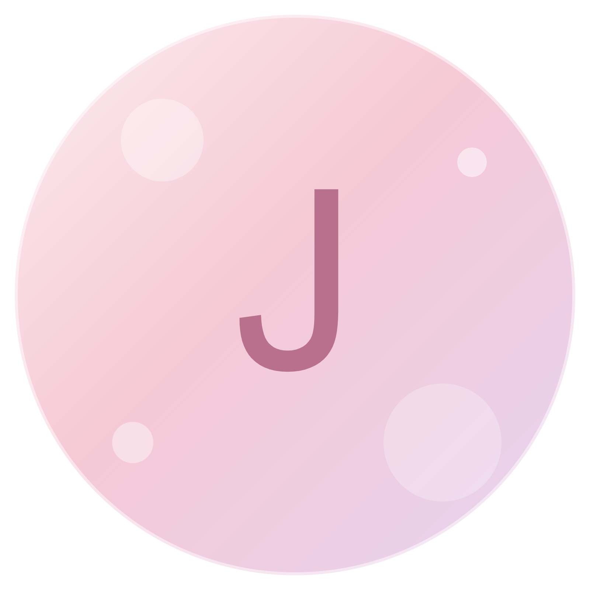

<!-- Banner — replace with your own (1200x300 recommended) -->

  

<h1>Jessy</h1>

  
  

 

 

## About

<table>
<tr><td width="140"><b>Role</b></td><td>Operation Staff at S2 Global Logistics Co., Ltd.</td></tr>
<tr><td><b>Education</b></td><td>Computer Science — full-stack development & data structures</td></tr>
<tr><td><b>Languages</b></td><td>Khmer (native), English (upper-intermediate)</td></tr>
<tr><td><b>Currently building</b></td><td>JESI-COSMETIC — a K-beauty e-commerce platform</td></tr>
</table>

 

## Projects

<table>
<tr>
<td width="50%" valign="top">

### JESI-COSMETIC
[View repository](https://github.com/Rniyy/jesi-cosmetic)

Full-stack K-beauty e-commerce platform with a desktop client. Includes a complete order lifecycle, an admin analytics dashboard, and JWT/bcrypt authentication with role-based access control.

`Node.js` `Express` `MySQL` `Electron` `Docker`

</td>
<td width="50%" valign="top">

### DSA Library Management System
[View repository](https://github.com/Rniyy/library-management-system)

Group project implementing customer and transaction management using singly linked lists, following strict course-defined function conventions with full file persistence.

`C++` `Data Structures` `File I/O`

</td>
</tr>
</table>

 

 

## Tech Stack

 

## GitHub Stats

 

 

## Contact

 

Thanks for visiting my profile.

